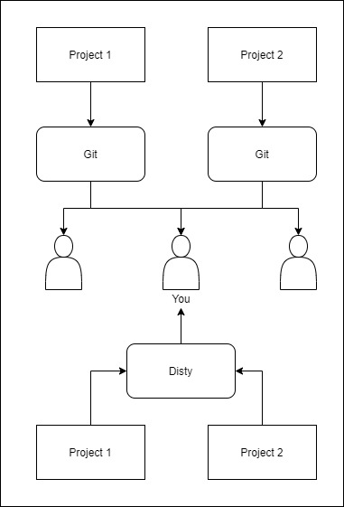

# Disty
[](https://forthebadge.com) [](https://forthebadge.com) [](https://forthebadge.com)
<br/>
Disty is a git-like project tracking system designed for individuals to store their projects **as is** on personal cloud spaces.

## Usage
The easiest way to get Disty up and running is by deploying Disty on your personal [Heroku server](https://www.heroku.com/) and add the URL as remote in your local repo

Compile and start the server on Heroku by passing a port and a directory path for storage:
```shell
# Compile and add disty.exe to your PATH
$ go build -o disty ./src

# Start the server
$ disty serve -port=PORT -dir=~/tmp
```
On your local machine, type the following commands for setup:
```shell
$ mkdir project && cd project
$ disty init -name=Supercoolproject
$ disty remote -url=HEROKU_URL_HERE
```

Disty is ready to track files as your project proceeds. To push or pull changes type the following commands:
```shell
$ disty sync
$ disty add .
	or
$ disty add main.c Makefile ./src/math_def.h
$ disty push
```

To see the current status of your project:
```shell
$ disty status
```

## Features
- Push/Pull functionality
- Project wise config
- No third-party dependencies
- Git-like User Interface


## Commands
- `init`
	Initialize Disty repo in current directory
	Flags:
	- `name` Name of the project (Default: "default")

- `remote` - Add remote server
	Flags:
	- `name` Name of the project (Default: "")
- `config` - Configure Username and Password
	Flags:
	- `username` Username for project (Default: "")
	- `password` Password for project (Default: "")
- `add` - Add files to track
- `status` - Displays the status of project
- `clone` - Clone a repo from remote server
	Flags:
	- `url` URL of remote server to clone (Default: "")
	- `dir` Path of dir to clone repo to (Default: "")
- `pull` - Pull latest changes from remote server
- `push` - Push changes to remote server
- `serve` - Start Disty Server
	Flags:
	- `port` Port to start Disty server (Default: 3000)
	- `dir` Directory path for server to store projects in (Default: "./")
- `sync` - **(TODO)** Sync project to remote server ie. Add project to remote server

## FAQ
### Should I replace Git with Disty?
No. Never. Infact, Disty works very well alongside Git. One can use it to `push` files that would traditionally be in `.gitignore` and hence untracked. The idea behind disty is to store the project **as is** for an individual. One can also use Disty to make projects portable or push binaries and libraries (*.so/*.dll/*.lib). Here is an image to show exactly where Disty lies: <br/>


## Roadmap
- HTTPS transfer
- Better File I/O Handling
- Request/Response Authorization

## Issues
I am aware of various bugs present and will be working on it. PRs are always welcome.